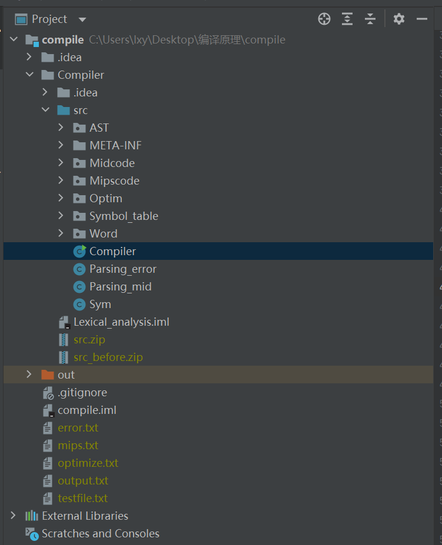
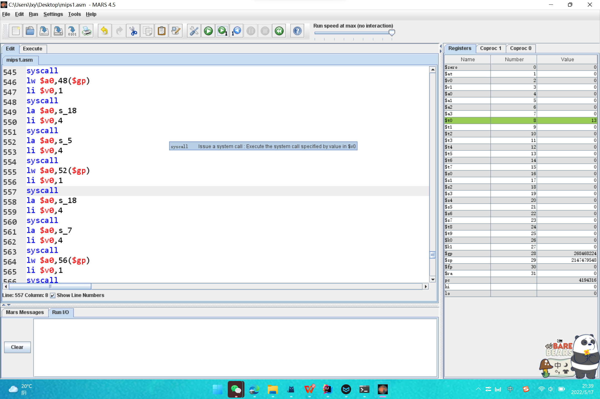
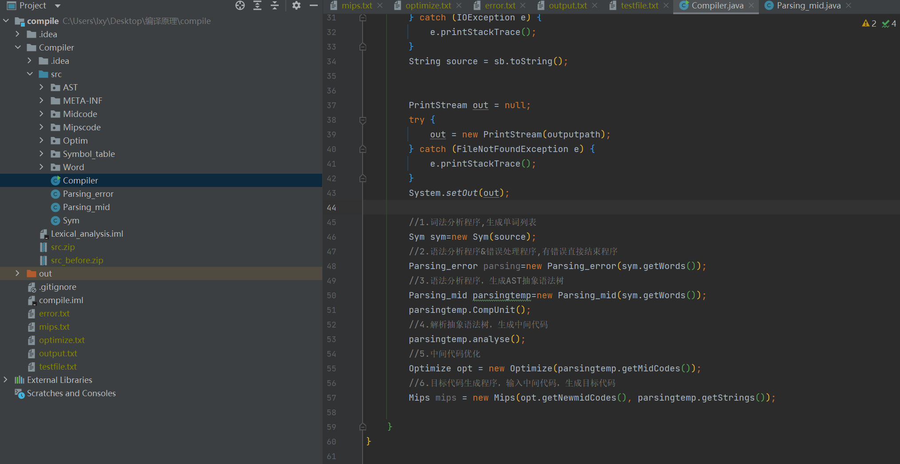
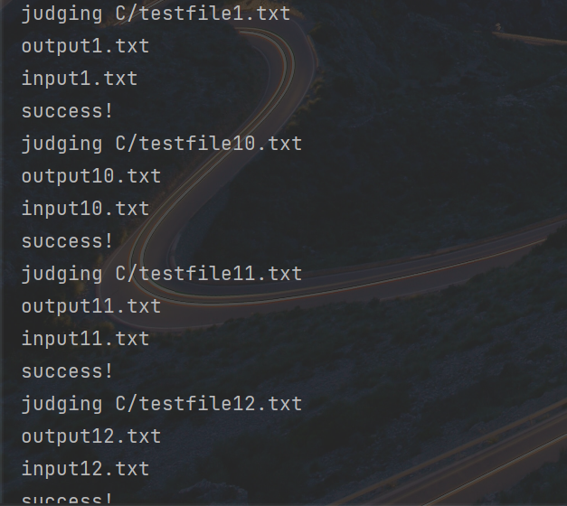

## SysY_compiler Written in Java

2021-2022 BUAA Compile course homework

c语言子集SysY    =>    Mips

### 1.文法说明

```python
编译单元 CompUnit → {Decl} {FuncDef} MainFuncDef // 1.是否存在Decl 2.是否存在FuncDef
声明 Decl → ConstDecl | VarDecl // 覆盖两种声明
常量声明 ConstDecl → 'const' BType ConstDef { ',' ConstDef } ';' // 1.花括号内重复0次 2.花括号内重复多次
基本类型 BType → 'int' // 存在即可
常数定义 ConstDef → Ident { '[' ConstExp ']' } '=' ConstInitVal // 包含普通变量、⼀维数组、⼆维数组共三种情况
常量初值 ConstInitVal → ConstExp| '{' [ ConstInitVal { ',' ConstInitVal } ] '}' // 1.常表达式初值 2.⼀维数组初值3.⼆维数组初值
变量声明 VarDecl → BType VarDef { ',' VarDef } ';' // 1.花括号内重复0次 2.花括号内重复多次
变量定义 VarDef → Ident { '[' ConstExp ']' } // 包含普通变量、⼀维数组、⼆维数组定义| Ident { '[' ConstExp ']' } '=' InitVal
变量初值 InitVal → Exp | '{' [ InitVal { ',' InitVal } ] '}'// 1.表达式初值 2.⼀维数组初值 3.⼆维数组初值
函数定义 FuncDef → FuncType Ident '(' [FuncFParams] ')' Block // 1.⽆形参 2.有形参
标识符Ident（需要覆盖的情况以注释形式给出）：
数值常量（需要覆盖的情况以注释形式给出）：
主函数定义 MainFuncDef → 'int' 'main' '(' ')' Block // 存在main函数
函数类型 FuncType → 'void' | 'int' // 覆盖两种类型的函数
函数形参表 FuncFParams → FuncFParam { ',' FuncFParam } // 1.花括号内重复0次 2.花括号内重复多次
函数形参 FuncFParam → BType Ident ['[' ']' { '[' ConstExp ']' }] // 1.普通变量2.⼀维数组变量 3.⼆维数组变量
语句块 Block → '{' { BlockItem } '}' // 1.花括号内重复0次 2.花括号内重复多次
语句块项 BlockItem → Decl | Stmt // 覆盖两种语句块项
语句 Stmt → LVal '=' Exp ';' // 每种类型的语句都要覆盖
 | [Exp] ';' //有⽆Exp两种情况
 | Block
 | 'if' '(' Cond ')' Stmt [ 'else' Stmt ] // 1.有else 2.⽆else
 | 'while' '(' Cond ')' Stmt
 | 'break' ';' | 'continue' ';'
 | 'return' [Exp] ';' // 1.有Exp 2.⽆Exp
 | LVal '=' 'getint''('')'';'
 | 'printf''('FormatString{','Exp}')'';' // 1.有Exp 2.⽆Exp
表达式 Exp → AddExp 注：SysY 表达式是int 型表达式 // 存在即可
条件表达式 Cond → LOrExp // 存在即可
左值表达式 LVal → Ident {'[' Exp ']'} //1.普通变量 2.⼀维数组 3.⼆维数组
基本表达式 PrimaryExp → '(' Exp ')' | LVal | Number // 三种情况均需覆盖
数值 Number → IntConst // 存在即可
⼀元表达式 UnaryExp → PrimaryExp | Ident '(' [FuncRParams] ')' // 3种情况均需覆盖,函数调⽤也需要覆盖FuncRParams的不同情况
 | UnaryOp UnaryExp // 存在即可
单⽬运算符 UnaryOp → '+' | '−' | '!' 注：'!'仅出现在条件表达式中 // 三种均需覆盖
函数实参表 FuncRParams → Exp { ',' Exp } // 1.花括号内重复0次 2.花括号内重复多次 3.Exp需要覆盖数组传参和部分数组传参
乘除模表达式 MulExp → UnaryExp | MulExp ('*' | '/' | '%') UnaryExp //1.UnaryExp 2.* 3./ 4.% 均需覆盖
加减表达式 AddExp → MulExp | AddExp ('+' | '−') MulExp // 1.MulExp 2.+ 需覆盖 3.-需覆盖
关系表达式 RelExp → AddExp | RelExp ('<' | '>' | '<=' | '>=') AddExp // 1.AddExp2.< 3.> 4.<= 5.>= 均需覆盖
相等性表达式 EqExp → RelExp | EqExp ('==' | '!=') RelExp // 1.RelExp 2.== 3.!=均需覆盖
逻辑与表达式 LAndExp → EqExp | LAndExp '&&' EqExp // 1.EqExp 2.&& 均需覆盖
逻辑或表达式 LOrExp → LAndExp | LOrExp '||' LAndExp // 1.LAndExp 2.|| 均需覆盖
常量表达式 ConstExp → AddExp 注：使⽤的Ident 必须是常量 // 存在即可
```

### 2.项目文件目录说明

根文件夹中有5个文件夹，分别为：

* `compile`为优化后最终版的编译项目代码

* `compile_优化前`为优化前的编译项目代码（相对来说比优化后版本的后端生成代码可读性更强）

* `文档`包括整个编译项目的总结文档（更加具体的项目架构见该文档）和测试样例。

* `test_compile`为测试项目文件夹。

* `img`保存部分markdown引用图片

* `mars.jar`为mips汇编程序和运行时模拟器

### 3.项目基本运行说明

以优化后的代码项目为例，优化前基本同理）



如上图为项目目录文件架构，以下对各文件进行一个简单的介绍：

1. `src`内部为源代码,其中Compiler为核心启动代码。

2. testfile.txt为编译器输入文件，文法为c语言子集SyYs。

3. output.txt为输出的四元式中间代码。

4. optimize.txt为优化后的四元式中间代码。

5. mips.txt为最终生成的mips目标代码。

6. error.txt为生成的错误码，如果输入文件中存在规定类型的语法或语义错误，会在该文件中显示，并中途结束程序的运行。

运行方式为在testfile.txt文件中输入对应代码，点击运行完成后最终目标会生成在mips.txt文件中。mips汇编代码可以在命令行中输入指令运行mars文件

```bash
java -jar mars.jar
```

然后在下图的仿真器中进行运行，得出汇编运行结果。



### 4.项目内部文件代码说明


如上图，主要先对src各文件及文件夹作用进行解释：

1. AST：抽象语法树节点，其中包括了所有生成AST抽象语法树的节点，中间代码通过解析生成的抽象语法树得到。

2. Midcode：中间代码包，包括中间代码的定义

3. Mipscode：目标代码包，包括后端目标代码的定义和生成方法

4. Optim：优化包，包括进行优化的一些代码

5. Symbol_table：符号表定义

6. Word：词法解析中部分词的定义

7. Sym：词法解析单元

8. Compiler：编译运行核心单元，调用各模块进行解析

9. Parsing_error：语法解析+错误处理

10. Parsing_mid：语法解析+抽象语法树AST生成

以下为Compiler主类的方法注释附图



右侧对各方法的调用模块和目标进行了解释

### 5.项目代码自动化测试方法

/test_compile为项目代码自动化测试文件夹。其中testfiles/内部为测试文件，`compile.jar`为测试编译器原文件，测试前可将编译器源码带包为jar文件进行测试。自动化测试脚本文件为`judge_for_outputfile.py`，将该文件运行可进行自动化测试。

其中

```python
#分别修改opt为A/和B/，可对所有测试文件进行测试。正确测试结果应如下图
test_files_root = "./testfiles/"
output_files_root = "./output/"
ans_files_root = "./grammar/"
opt = "C/"
```


